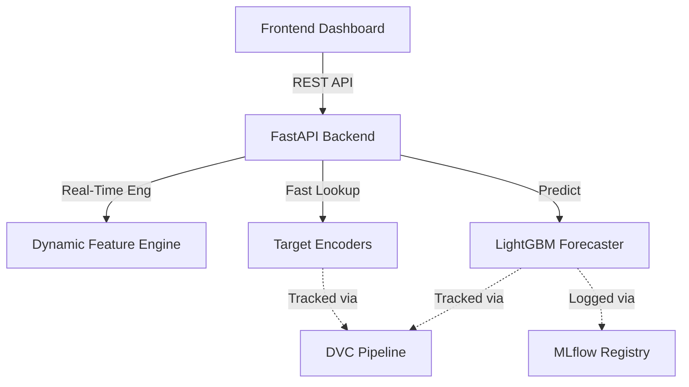

<div align="center">
  <h1>📈 M5 Enterprise Demand Intelligence</h1>
  <p><strong>A Production-Grade MLOps Platform for Zero-Inflated Retail Forecasting</strong></p>

  <p>
    
    
    
    
    
  </p>
</div>

---

## 📖 Executive Summary

The **M5 Demand Intelligence** system tackles one of the most notoriously difficult problems in retail supply chain management: forecasting highly volatile, intermittent demand (specifically the **FOODS** category across multiple locations). 

With over **61.7% of historical data consisting of exact zeros**, traditional regression models (optimized for RMSE) fail catastrophically by over-predicting. This project implements a **Tweedie-objective LightGBM architecture** wrapped in a highly optimized, state-of-the-art FastAPI backend and an interactive analytics dashboard.

---

## ✨ Core Capabilities

- 🧠 **Tweedie Loss Function:** Specifically designed to bridge Poisson (counts) and Gamma (continuous) distributions, accurately modeling intermittent zero-inflated sales.
- ⚡ **O(1) Inference Engine:** Artifacts and Extreme Target Encoders are pre-loaded into RAM via `joblib`, bringing API latency down to milliseconds.
- 🔄 **Real-Time Feature Engineering:** Lag features (7, 28 days) and rolling means are dynamically computed on the fly using Pandas vectorization.
- 📊 **Executive Dashboard:** A stunning, dark-themed responsive UI built with Vanilla JS & Chart.js, visualizing portfolio backtests, live demand classes, latency tracking, and stockout risks.
- 🐳 **Full MLOps Lifecycle:** Integrated with **DVC** for data/model versioning, **MLflow** for experiment tracking, and **Docker Compose** for single-command deployments.

---

## 🏗️ System Architecture



---

## 💻 Tech Stack

### AI / Data Science
* **LightGBM** - Gradient Boosting Framework optimized for Tweedie loss.
* **Pandas & NumPy** - Core data manipulation and on-the-fly feature engineering.
* **Optuna** - Hyperparameter optimization.

### Engineering & MLOps
* **FastAPI** - High-performance asynchronous API framework.
* **MLflow** - Model registry, metrics, and parameter tracking.
* **DVC (Data Version Control)** - Managing large datasets and `.parquet`/`.pkl` artifacts.
* **Docker & Docker Compose** - Containerized microservices (Backend, Frontend, MLflow).

### Frontend
* **Vanilla HTML/CSS/JS** - Zero-dependency, lightning-fast UI.
* **Chart.js** - Dynamic and responsive data visualization.

---

## 🚀 Getting Started

### 1. Prerequisites
Ensure you have the following installed on your machine:
- [Docker & Docker Compose](https://www.docker.com/)
- [Git](https://git-scm.com/)

### 2. Clone the Repository
```bash
git clone https://github.com/your-username/m5-demand-intelligence.git
cd m5-demand-intelligence
```

### 3. Deploy via Docker Compose
This will spin up the FastAPI Backend, the Nginx Frontend, and the MLflow Tracking Server simultaneously.
```bash
docker-compose up --build -d
```

### 4. Access the Services
- **Executive Dashboard:** [http://localhost:80](http://localhost:80)
- **FastAPI Interactive Docs (Swagger):** [http://localhost:8000/docs](http://localhost:8000/docs)
- **MLflow Tracking Server:** [http://localhost:5000](http://localhost:5000)

---

## 📡 API Reference

### `POST /predict`
Generates a real-time demand forecast for a specific item and store.

**Request Body:**
```json
{
  "store_id": "CA_1",
  "item_id": "FOODS_3_090"
}
```

**Response:**
```json
{
  "store_id": "CA_1",
  "item_id": "FOODS_3_090",
  "forecast_date": "d_1914",
  "predicted_sales": 3.42,
  "latency_ms": 12.4,
  "trend_dates": ["d_1900", "d_1901", "..."],
  "trend_sales": [0, 2, 0, "..."]
}
```

### `GET /system-health`
Returns the operational status of the MLOps pipeline.

---

## 🧪 The Science: Why Tweedie?

In standard machine learning, the `RMSE` (Root Mean Squared Error) objective tries to punish the model for missing the exact magnitude of a spike. In intermittent retail data, where a product might sell 0 units for 5 days and then 10 units on the 6th day, RMSE will force the model to predict ~1.5 units every single day.

By using the **Tweedie Distribution (Variance Power ~1.1)**, the model predicts the *Statistical Expected Value*. This is mathematically identical to how modern supply chains calculate **Safety Stock Requirements**, allowing business stakeholders to maintain inventory without overstocking on zero-demand days.

---

## 🛡️ License

This project is licensed under the MIT License - see the [LICENSE](LICENSE) file for details.

<div align="center">
  <p>Built with ❤️ for High-Performance Retail Analytics</p>
</div>
